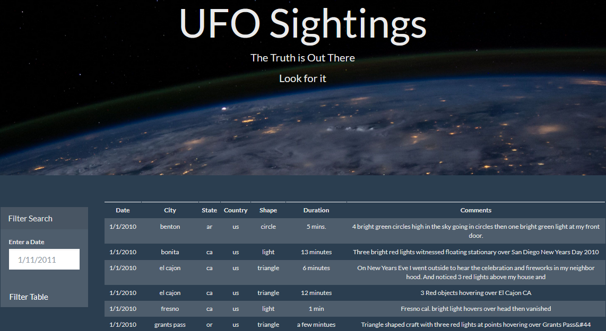
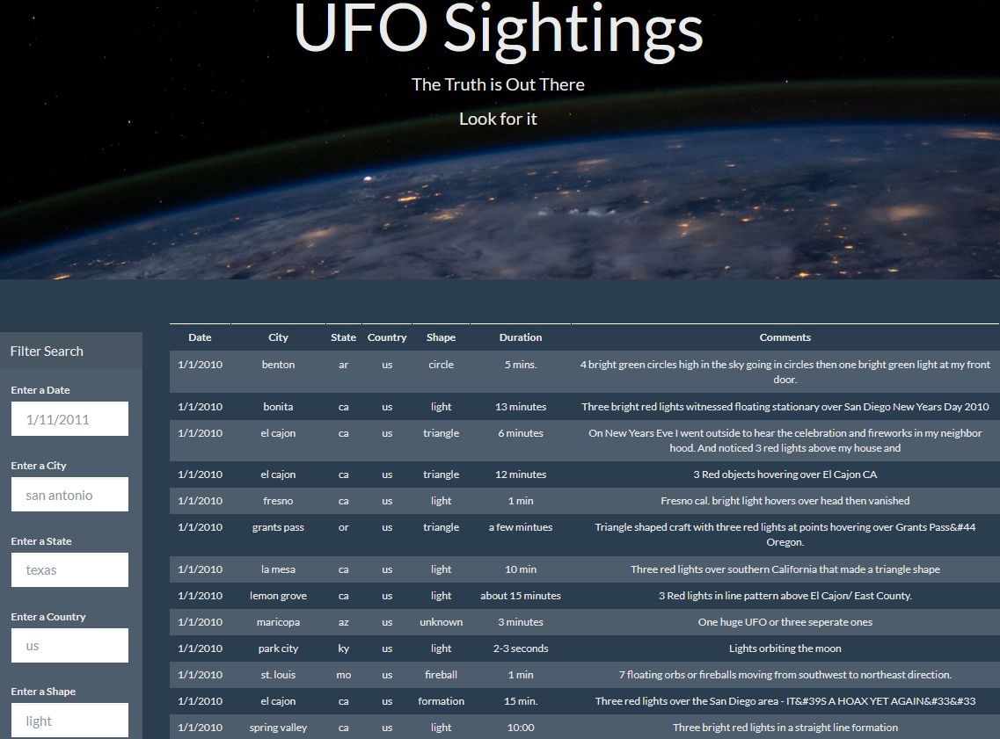

# javascript- JavaScript and DOM Manipulation                   

## Background

WAKE UP SHEEPLE! The extra-terrestrial menace has come to Earth and we have collected all of the eye-witness 

reports we could to prove it! All we need to do now is put this information online for the world to see and 

then the matter will finally be put to rest. There is just one tiny problem though. our collection is too large to search through manually. 

Even our most dedicated followers are complaining that they are having trouble locating specific reports in this mess.

That's why we need to create a webpage with a table that is dynamically based upon a [dataset](UFO-level-1/static/js/data.js) using JavaScript, HTML, CSS, and D3.

We will also allow our users to filter the table data for specific values.

 

## Analysis

Broken into two levels:

### Level 1: Automatic Table and Date Search

* Created a basic HTML web page [index.html](UFO-level-1/index.html).

* Using the UFO dataset provided in the form of an array of JavaScript objects. 

* Wrote a code that appends a table to the web page and then adds new rows of data for each UFO sighting.

  * Table columns are: `date/time`, `city`, `state`, `country`, `shape`, and `comment`.

* Use a date form in the HTML document and write JavaScript code that will listen for events and search through 

the `date/time` column to find rows that match user input.

#### UFO Level-1		

### Level 2: Multiple Search Categories

* Using multiple `input` tags, wrote a JavaScript code so the user can set multiple filters and search for UFO 
sightings using the following criteria based on the table columns:

  1. `date/time`
  2. `city`
  3. `state`
  4. `country`
  5. `shape`
#### UFO Level-2		

- - -

